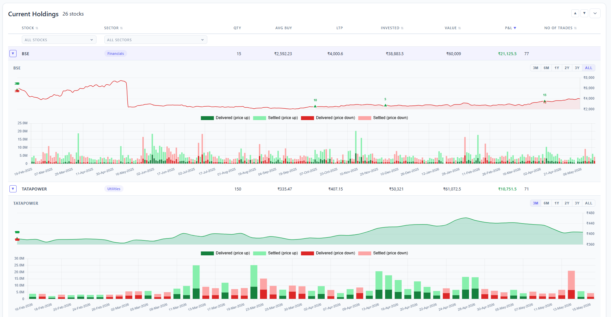

# TuneFolio

**Observe. Tune. Invest.**

TuneFolio is a **read-only portfolio intelligence platform** that helps investors
understand *why* their portfolio behaves the way it does — using secure,
consent-based integration with Zerodha.

It focuses on **explainability, context, and historical insight**, not trading,
predictions, or execution.

Investing isn’t just about markets — it’s about mastering your own thinking patterns, understanding how you respond to volatility, taking right risks at the right time, knowing and tuning yourself with the markets both for a resonant profit and upcoming opportunities that suit your style. 

TuneFolio gives you clarity into your portfolio’s behavior, sector exposure, capital allocation, and time-based performance. No noise. No predictions. Just structured intelligence about how you invest. Observe your decisions. Tune your strategy. Invest with conviction. 

TuneFolio is portfolio intelligence — clean, structured, and personal. Because wealth isn’t just built by markets. It’s built by understanding how you invest and taking the right risks that suit you. The beta version of TuneFolio is coming soon — be among the first to experience portfolio intelligence, redefined.

---
[The Core Idea Link](https://www.youtube.com/watch?v=Ec75hA47hck)

## Dashboard — Current Holdings

*Current Holdings view showing stock-level price charts with delivery volume stacked bars (Delivered vs Settled), sector tagging, and real-time P&L.*

---

## Vision

TuneFolio aims to become a **personal investment memory system** —
a place where data explains decisions, not just outcomes.

## Why TuneFolio

Most portfolio tools answer *“What is my P&L today?”*  
TuneFolio is built to answer:

- Why did my portfolio perform this way?
- Which decisions contributed to gains or losses?
- How has my portfolio evolved over time?
- How are the volumes of a particular stock in last couple of weeks? or Last quarter? or last 6 months?

### Core Focus
- Time-aware portfolio analysis (SoD / EoD snapshots)
- Decision attribution, not predictions
- Historical context over point-in-time noise

---
## What TuneFolio Does Today

### Live Zerodha Integration
- Secure OAuth login with Zerodha
- Read-only access (no trading, no execution)
- Active session management

### Portfolio Overview
- Live holdings with:
  - Quantity
  - Average buy price
  - Current market price
  - Invested value
  - Current value
  - Real-time P&L
- Auto-calculated portfolio KPIs:
  - Total invested value
  - Current portfolio value
  - Net P&L

### Instrument & Sector Intelligence
- Instruments auto-populated from holdings
- Sector and industry auto-enriched and cached
- No manual tagging when new stocks are added

### Historical Data Foundation
- Snapshot-based holdings storage
- Designed for:
  - Start-of-Day (SoD) snapshots
  - End-of-Day (EoD) snapshots
- Enables future time-series and performance attribution

### Frontend Dashboard
- Lightweight HTML, CSS, and JavaScript UI
- KPI cards and holdings table
- Designed to organically absorb future features

---

## What TuneFolio Does *Not* Do

- ❌ No trading or execution
- ❌ No investment advice
- ❌ No predictions or signals
- ❌ No automated decision-making

TuneFolio is an **explainability layer**, not a trading terminal.

---

## Product Principles

- Insight over action
- Context over noise
- Trust over automation
- Data as a product

---

## Architecture (Current)

---

## Status

🟢 **Core platform operational**
- Authentication: ✅
- Live holdings: ✅
- Portfolio KPIs: ✅
- Sector enrichment: ✅
- Snapshot storage: ✅

🚧 **In progress**
- Trading journal and decision history
- Time-series portfolio insights

---

